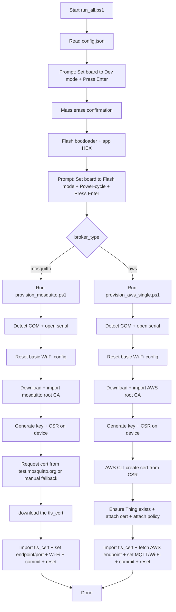

# Bin Quick Start (AWS + Mosquitto)

This `bin/` flow supports `broker_type: "aws"` and `broker_type: "mosquitto"`.

## Files in `bin/`

- `flash.ps1`: flashes bootloader + selected app binary
- `provision_mosquitto.ps1`: mosquitto provisioning flow
- `provision_aws_single.ps1`: AWS single-thing provisioning flow
- `run_all.ps1`: runs flash, then provisioning
- `config.json`: profile and connection settings

## Prerequisites

1. Windows + PowerShell
2. Install STM32CubeProgrammer:
   - https://www.st.com/content/st_com/en/products/development-tools/software-development-tools/stm32-software-development-tools/stm32-programmers/stm32cubeprog.html
   - Make sure `STM32_Programmer_CLI.exe` is available at:
   `C:\Program Files\STMicroelectronics\STM32Cube\STM32CubeProgrammer\bin\STM32_Programmer_CLI.exe`
3. Board connected through ST-LINK USB
4. Internet access (scripts download broker Root CA automatically)
5. If you plan to use `broker_type: "aws"`:
   - Install AWS CLI v2
   - Configure credentials/region with `aws configure`

## Quick Start

1. Open `bin/config.json`
2. Choose `broker_type` in `config.json` (`mosquitto` or `aws`).
3. Run:

```powershell
cd .\bin
.\run_all.ps1
```

4. When prompted, set the STM32N6-DK board to **Dev mode**, then press Enter.
5. Confirm the mass-erase prompt (`y`) when asked.
6. When prompted after flashing, set the STM32N6-DK board to **Flash mode**, then power-cycle the board, then press Enter.

## What `run_all.ps1` Does



Notes:
- Provisioning output is shown live in console and appended to `bin/log.txt`.
- `run_all.ps1` automatically picks the provisioning script from `broker_type`.

### Option A: Mosquitto

Example:

```json
{
  "broker_type": "mosquitto",
  "wifi_ssid": "YOUR_WIFI",
  "wifi_credential": "YOUR_PASSWORD"
}
```

Notes:
- `provision_mosquitto.ps1` generates key + CSR on device.
- It tries to auto-request a client cert from `https://test.mosquitto.org/ssl/`.
- If auto-request fails, it falls back to manual cert download and asks for cert path.

### Option B: AWS

Example:

```json
{
  "broker_type": "aws",
  "wifi_ssid": "YOUR_WIFI",
  "wifi_credential": "YOUR_PASSWORD"
}
```

Notes:
- AWS endpoint is fetched automatically from AWS CLI (`aws iot describe-endpoint`).
- AWS MQTT port is fixed to `8883` in the script.
- AWS Root CA is downloaded automatically in the script.
- Make sure AWS CLI is installed and configured (`aws configure`).

AWS behavior:
- The script creates certificate from CSR and registers/attaches it.
- Default policy name is `AllowAllDev` (or `aws_policy_name` if provided in `config.json`).
- If the selected AWS IoT policy does not exist, the script creates it automatically with a default allow-all policy document, then attaches it.

## Run the Examples

After provisioning, use these feature guides:

- [LED Control Example](../project/Common/app/led/readme.md)
- [Button Status Example](../project/Common/app/button/readme.md)

## For Other Configurations

Use the main project documentation:

- [Main README](../readme.md)
- [Mosquitto provisioning guide](../provision_mosquitto.md)
- [AWS single-device provisioning guide](../provision_aws_single_script.md)

## Run and Test Examples After Provisioning

After onboarding is complete, run the application examples from the main project README:

- [Run the Examples](../readme.md#run-the-examples)

---

[Back to Main README](../readme.md)
