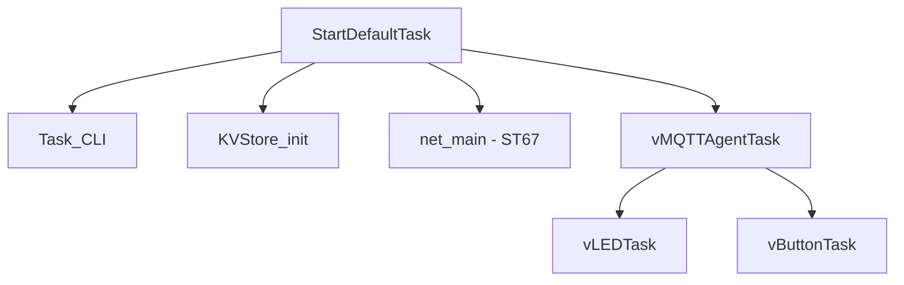

# Architecture

This document describes the runtime architecture and where key configuration points are located in the codebase.

## Runtime Overview

Boot starts in `StartDefaultTask`, which initializes CLI, KVS, networking, and MQTT services before launching the application tasks.

Primary entry points:

- Task creation and startup: `Appli/Core/Src/app_freertos.c`
- Task toggles/priorities/stacks: `Appli/Core/Inc/main.h`
- MQTT agent interface: `Appli/Common/app/mqtt/mqtt_agent_task.h`

## FreeRTOS Configuration

FreeRTOS configuration is split between:

- Kernel configuration: `Appli/Core/Inc/FreeRTOSConfig.h`
- Project task configuration: `Appli/Core/Inc/main.h`

Key items in `main.h`:

- `DEMO_LED`, `DEMO_BUTTON`
- `TASK_PRIO_*`
- `TASK_STACK_SIZE_*`

## LwIP Configuration

LwIP behavior is configured in:

- `Appli/Common/config/lwipopts.h`
- `Appli/Common/net/lwip_port/include/lwipopts_freertos.h`

Integration sources:

- `Appli/Common/net/W6X_ARCH_T02/lwip.c`
- `Appli/Common/net/W6X_ARCH_T02/lwip_netif.c`
- `Appli/Common/net/lwip_port/lwip_freertos.c`

## mbedTLS Configuration

TLS/crypto integration spans:

- `Appli/core/inc/mbedtls_config_hw.h`
- `Appli/core/inc/mbedtls_config_ntz.h`
- `Appli/Common/crypto/mbedtls_freertos_port.c`
- `Appli/Common/net/lwip_port/mbedtls_transport.c`
- `Appli/Core/Src/corePKCS11/core_pkcs11_mbedtls.c`

## Security and RTOS Glue in `Appli/Core/Src`

### `corePKCS11/`

- `core_pkcs11_mbedtls.c` implements PKCS#11 session/object/mechanism handling on top of mbedTLS.
- Used by TLS/provisioning flows to access device key/certificate objects.

### `crypto/`

- `core_pkcs11_pal_littlefs.c` provides PKCS#11 object storage on littlefs.
- `core_pkcs11_pal_utils.c/.h` maps PKCS#11 labels/handles to stored object filenames.
- `hardware_rng.c` provides hardware RNG integration for mbedTLS entropy.

### `FreeRTOS/`

- `freertos_hooks.c` contains RTOS hook implementations (idle, malloc-fail, stack overflow), watchdog helpers, and runtime stats helpers.
- `freertos_hooks.h` exposes hook/reset declarations used across the project.
