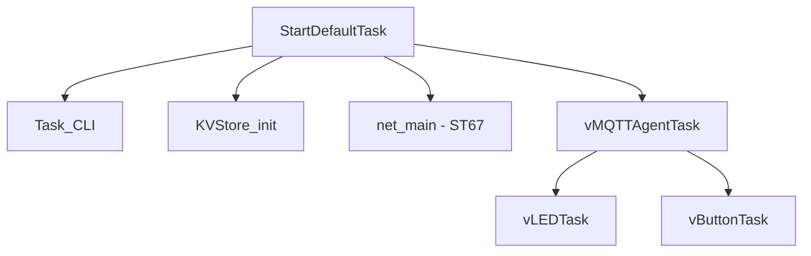

# Architecture

This document describes the runtime architecture and where key configuration points are located in the codebase.

## Runtime Overview

Boot starts in `StartDefaultTask`, which initializes CLI, KVS, networking, and MQTT services before launching the application tasks.

Primary entry points:

- Task creation and startup: `Appli/Core/Src/app_freertos.c`
- Task toggles/priorities/stacks: `Appli/Core/Inc/main.h`
- MQTT agent interface: `Appli/Common/app/mqtt/mqtt_agent_task.h`

## FreeRTOS Configuration

FreeRTOS configuration is split between:

- Kernel configuration: `Appli/Core/Inc/FreeRTOSConfig.h`
- Project task configuration: `Appli/Core/Inc/main.h`

Key items in `main.h`:

- `DEMO_LED`, `DEMO_BUTTON`
- `TASK_PRIO_*`
- `TASK_STACK_SIZE_*`

## LwIP Configuration

LwIP behavior is configured in:

- `Appli/Common/config/lwipopts.h`
- `Appli/Common/net/lwip_port/include/lwipopts_freertos.h`

Integration sources:

- `Appli/Common/net/W6X_ARCH_T02/lwip.c`
- `Appli/Common/net/W6X_ARCH_T02/lwip_netif.c`
- `Appli/Common/net/lwip_port/lwip_freertos.c`

## mbedTLS Configuration

TLS/crypto integration spans:

- `Appli/core/inc/mbedtls_config_hw.h`
- `Appli/core/inc/mbedtls_config_ntz.h`
- `Appli/Common/crypto/mbedtls_freertos_port.c`
- `Appli/Common/net/lwip_port/mbedtls_transport.c`
- `Appli/Core/Src/corePKCS11/core_pkcs11_mbedtls.c`

## Security and RTOS Glue in `Appli/Core/Src`

### `corePKCS11/`

- `core_pkcs11_mbedtls.c` implements PKCS#11 session/object/mechanism handling on top of mbedTLS.
- Used by TLS/provisioning flows to access device key/certificate objects.

### `crypto/`

- **`core_pkcs11_pal_littlefs.c`**  
  Provides PKCS#11 object storage on LittleFS (persisting keys, certificates, and metadata).

- **`core_pkcs11_pal_utils.c/.h`**  
  Maps PKCS#11 labels and handles to LittleFS object filenames and lookup structures.

- **`hardware_rng.c`**  
  Implements hardware RNG integration for mbedTLS entropy (used by `mbedtls_entropy_func` via `MBEDTLS_ENTROPY_HARDWARE_ALT`).

- **`aes_alt.c`**  
  Provides the mbedTLS AES hardware‑accelerated implementation using the STM32 CRYP peripheral (used by mbedtls via `MBEDTLS_AES_ALT`).

- **`ecdh_alt.c`**  
  Provides hardware‑accelerated ECDH public key generation and shared‑secret computation using the STM32 PKA peripheral (used by mbedtls via `MBEDTLS_ECDH_GEN_PUBLIC_ALT` and `MBEDTLS_ECDH_COMPUTE_SHARED_ALT`).

- **`ecdsa_alt.c`**  
  Provides hardware‑accelerated ECDSA sign/verify operations using the STM32 PKA peripheral (used by mbedtls via `MBEDTLS_ECDSA_SIGN_ALT` and `MBEDTLS_ECDSA_VERIFY_ALT`).

- **`ecp_alt.c`**  
  Provides hardware‑accelerated low‑level ECC point operations (curve math) for mbedTLS via the PKA peripheral (used by mbedtls via `MBEDTLS_ECP_INTERNAL_ALT`, `MBEDTLS_ECP_DOUBLE_JAC_ALT` and `MBEDTLS_ECP_ADD_MIXED_ALT`).

- **`sha256_alt.c`**  
  Provides hardware‑accelerated SHA‑256 hashing using the STM32 HASH peripheral (used by mbedtls via `MBEDTLS_SHA256_ALT`).

### `FreeRTOS/`

- `freertos_hooks.c` contains RTOS hook implementations (idle, malloc-fail, stack overflow), watchdog helpers, and runtime stats helpers.
- `freertos_hooks.h` exposes hook/reset declarations used across the project.

## LFS and PKCS11 Glue in `Appli/Libraries/`
### `fs/`
The **`fs/`** directory contains the LittleFS porting layer for the STM32N6570‑DK.  
Although multiple flash drivers are present, **this project uses the XSPI‑based path exclusively**:

- **`lfs_port_xspi.c`** — LittleFS port glue for the STM32N6 XSPI interface  
- **`xspi_nor_mx66uw1g45g.h`** — NOR flash definition for the MX66UW1G45G device used on the N6570‑DK  
- **`stm32_extmem.c`** — ST External Memory Manager integration providing the XSPI NOR abstraction used by the port

Together, these components implement the hardware‑adaptation layer that allows LittleFS to run on the MX66UW1G45G XSPI NOR flash device.

Other files in the folder (OSPI, internal NOR, U5/H5 variants) are present for portability but **not used** on this board.

### `pkcs11/`
Contains the public PKCS#11 Cryptoki API headers used by FreeRTOS‑PKCS11 and the PAL layer.

- **`pkcs11.h`** — Full PKCS#11 API definitions (types, attributes, mechanisms, structures). Required for building the PKCS#11 PAL and corePKCS11 library.  
- **`pkcs11t.h`** — Placeholder header included for compatibility with standard PKCS#11 header layouts; contains no project‑specific content.
