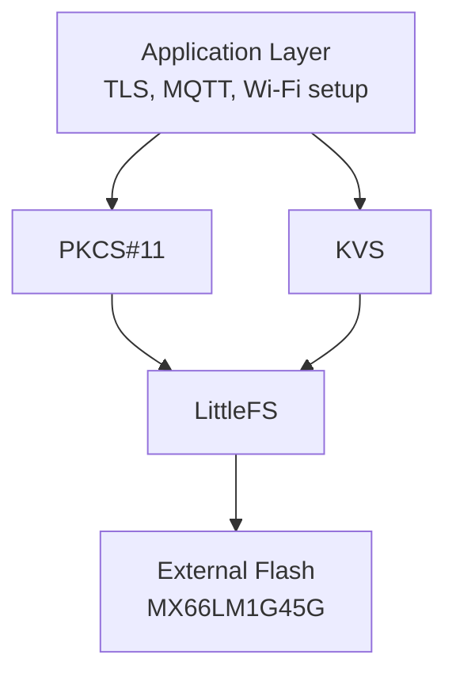

# Software Components

This firmware stack is built on a focused set of core components.

## Core Stack

- FreeRTOS kernel
- LwIP network stack
- MbedTLS TLS/crypto library
- PKCS#11 object interface
- FreeRTOS CLI

## FreeRTOS CLI

The FreeRTOS CLI is used for runtime setup, provisioning, and diagnostics.

See:

- [Appli/Common/cli/ReadMe.md](../Appli/Common/cli/ReadMe.md)

## PkiObject API

The PkiObject layer handles representation/conversion of certificates and keys used by TLS and provisioning flows.

See:

- [Appli/Common/crypto/ReadMe.md](../Appli/Common/crypto/ReadMe.md)

## Security and Storage Architecture

PKCS#11 and KVS are intentionally separated:

- PKCS#11: cryptographic objects (device key/certificates, CA certificates)
- KVS: runtime configuration (MQTT endpoint/port, Wi-Fi credentials, thing name)

This provides a flexible architecture where keys and runtime configuration can be placed in internal flash, external flash, or a secure element (STSAFE) without changing high-level application logic.
In practice, PKCS#11 and KVS abstract the application from storage medium details and security implementation choices.

### External Flash Storage Implementation

Keys, certificates, and runtime configuration are stored in **external flash** (MX66LM1G45G) accessed through abstraction layers:

- **Storage Abstraction**: Accessed via PKCS#11 and KVS libraries
- **File System**: LittleFS (LFS) creates a file system in external flash starting at block 64
  - Configuration: `Appli/Libraries/fs/xspi_nor_mx66uw1g45g.h` defines `MX66LM_RESERVED_BLOCKS (64)`
  - Port implementation: `Appli/Libraries/fs/lfs_port_xspi.c` provides the LFS port for STM32N6570-DK

**Data organization:**
- PKCS#11 objects (keys/certs): managed by `core_pkcs11_pal_littlefs.c`
- KVS configuration: stored and retrieved via KVS API (see [Appli/Common/kvstore/ReadMe.md](../Appli/Common/kvstore/ReadMe.md))

## Securing the Application

The STM32N6570 provides comprehensive security features for embedded IoT applications. This reference firmware integrates multiple defense layers:

### Hardware Security Features

The STM32N6570 includes built-in security capabilities:

- **Secure Engine**: Dedicated hardware for cryptographic operations (accelerators for RNG, SHA256, AES, PKA)
- **Memory Protection**: Controls for flash/RAM access and privilege levels
- **Secure Boot**: Verification of firmware integrity and authenticity
- **OEMuRoT (OEM micro-Root of Trust)**: Lightweight Root of Trust implementation for secure device provisioning and firmware updates

For detailed information on STM32N6 security architecture and features, see:

- [Security features on STM32N6 MCUs](https://wiki.st.com/stm32mcu/wiki/Security:Security_features_on_STM32N6_MCUs)
- [OEMuRoT for STM32N6](https://wiki.st.com/stm32mcu/wiki/Security:OEMuRoT_for_STM32N6)

### Application-Level Security

This firmware implements defense-in-depth:

1. **Cryptographic Operations**: All sensitive operations (TLS, key generation, hashing) use hardware accelerators where available via mbedTLS hardware abstraction layer
2. **Key Management**: Device keys and certificates are provisioned securely and managed through PKCS#11 abstraction
3. **Secure Communication**: TLS 1.2+ for all MQTT connections with mutual authentication
4. **Certificate Validation**: Strict validation of server certificates using device-stored CA certificates
5. **Secure Provisioning**: CLI-based provisioning with support for AWS IoT Core auto-provisioning workflows

### Deployment Recommendations

- Use the **HW_Crypto** build configuration for production deployments to maximize security performance
- Enable secure boot features on the STM32N6570 before deploying to production
- Review and customize the mbedTLS configuration in `mbedtls_config.h` based on your threat model
- Regularly update device firmware using secure boot mechanisms (OEMuRoT or equivalent)
- Maintain confidentiality of device certificates and keys stored in external flash—consider STSAFE integration for higher-security deployments
