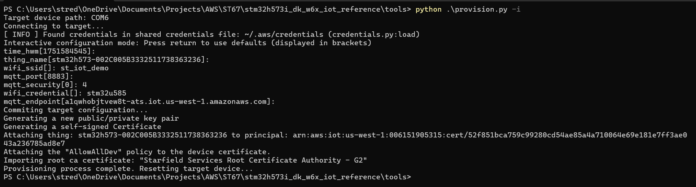

# AWS IoT Core Single-Device Provisioning for STM32N6570-DK (Python Script Method)

This guide explains how to provision a **single STM32N6570-DK device** on **AWS IoT Core** using the automated `provision.py` workflow.

See AWS background: [Single Thing Provisioning](https://docs.aws.amazon.com/iot/latest/developerguide/single-thing-provisioning.html).

## Supported Build Configurations

| Build Config | Provisioning Method |
|---|---|
| `ST67_T02_Single` | Single Thing Provisioning |

## 1. Hardware Setup

- Connect the Wi-Fi module to `Arduino`.
- Connect ST-Link USB to your PC for power, flashing, and debugging.

## 2. Prerequisites

1. Create an IAM user in AWS with IoT provisioning permissions (for example `AWSIoTFullAccess`, or equivalent least-privilege policy).
2. Install AWS CLI: https://docs.aws.amazon.com/cli/latest/userguide/getting-started-install.html
3. Configure AWS CLI:

```bash
aws configure
```

Provide access key, secret key, region, and output format.

## 3. Run Automated Provisioning with provision.py

From the repository root:

```bash
cd tools
pip install -r requirements.txt
python provision.py -i
```

Notes:

- Ensure the board is connected through ST-Link USB.
- Close any serial terminal before running the script.
- The script is interactive and prompts for fields such as:
  - `time_hwm`
  - `thing_name`
  - `wifi_ssid`
  - `mqtt_port`
  - `mqtt_security`
  - `wifi_credential`
  - `mqtt_endpoint`

Recommended values:

- Keep default values for `mqtt_endpoint`, `time_hwm`, `thing_name`, and `mqtt_port` unless you need overrides.
- Provide 2.4 GHz Wi-Fi credentials.

The script then automates:

- Device key generation
- Device certificate generation
- Thing creation and certificate registration in AWS IoT Core
- Policy attachment
- AWS root CA import



Reference: [FreeRTOS STM32U5 Getting Started (provision.py)](https://github.com/FreeRTOS/iot-reference-stm32u5/blob/main/Getting_Started_Guide.md#option-8a-provision-automatically-with-provisionpy)

## 4. Run the Examples

After provisioning, continue with:

- [Run the Examples](readme.md#run-the-examples)

---

[Back to Main README](readme.md)
