# Provision with Mosquitto

## 1. Connect with serial terminal

Open a serial terminal (e.g., Tera Term, PuTTY, [Web based](https://googlechromelabs.github.io/serial-terminal/)) at 115200, 8 bits, 1 stop, no parity.

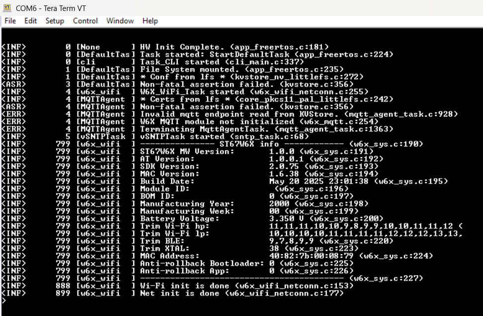

## 2. Get the ThingName

Each board automatically generates a unique Thing Name in the format `stm32n6-<DeviceUID>`, where `<DeviceUID>` corresponds to the device hardware Unique ID (UID). For example: `stm32n6-002C005B3332511738363236`. You can retrieve the Thing Name using the CLI. Save this device ID for further use. You can always retrieve it using the `conf get` command.

Type the following command on the serial terminal:

```
conf get
```
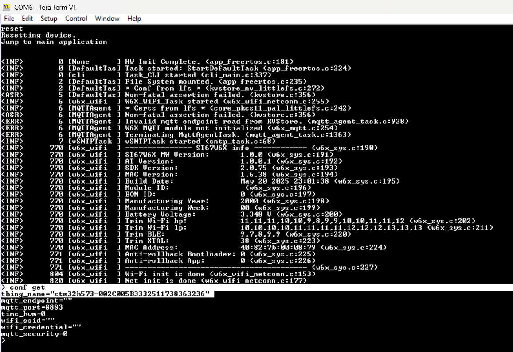

## 3. Generate key pair

Once the command is executed, the system generates an **ECC** key pair using the **MbedTLS** and **PKCS#11** libraries running on the host microcontroller. The key pair is stored in internal Flash via the **LFS** and **PKCS#11** stack. Upon success, the public key is printed to the terminal, confirming the device is ready to generate a **CSR** (Certificate Signing Request) for further provisioning or certificate issuance.

Type the following command on the serial terminal:

```
pki generate key
```

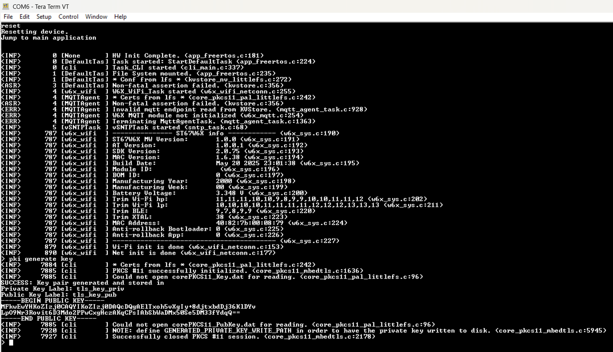

## 4. Generate Certificate Signing Request (CSR)

Use the following command in the serial terminal to generate a Certificate Signing Request (CSR):

```
pki generate csr
```

This command uses **MbedTLS** and **PKCS#11** running on the host microcontroller to create the CSR from the device’s key pair. The CSR will be printed in PEM format to the terminal.

The generated CSR is required to obtain a client certificate from [test.mosquitto.org](https://test.mosquitto.org), enabling the device to securely authenticate and connect to the Mosquitto MQTT broker using mutual TLS.

## 5. Generate Client Certificate

- Copy the entire CSR (including the `-----BEGIN CERTIFICATE REQUEST-----` and `-----END CERTIFICATE REQUEST-----` lines) from the terminal output.

- Visit [test.mosquitto.org’s](https://test.mosquitto.org/ssl/) CSR page.

- Paste the CSR into the designated text area.

- Click Submit.

Your client certificate will be generated and automatically downloaded by your browser (typically saved as **client.crt** in your Downloads folder).

If prompted with a browser security warning, accept it to complete the download.

> This provisioning flow is intended for testing and evaluation.  
> Certificates from test.mosquitto.org expire after 90 days and should not be used in production environments.

## 6. Import the TLS client certificate

After downloading the **client.crt** file from test.mosquitto.org, you’ll need to import it to your board using the serial terminal.

- On the serial terminal connected to your board, type the following CLI command:

```
pki import cert tls_cert
```

- Open the **client.crt** file you downloaded in a text editor (such as Notepad, VS Code, or nano). Copy the entire contents—be sure to include the lines: `-----BEGIN CERTIFICATE-----` … `-----END CERTIFICATE-----`. Then, paste the content into the serial terminal where your board is running and press Enter.

The board will verify the certificate and securely store it in internal Flash using the MbedTLS, PKCS#11, and LFS libraries. If everything is successful, you’ll see a confirmation message in the terminal.

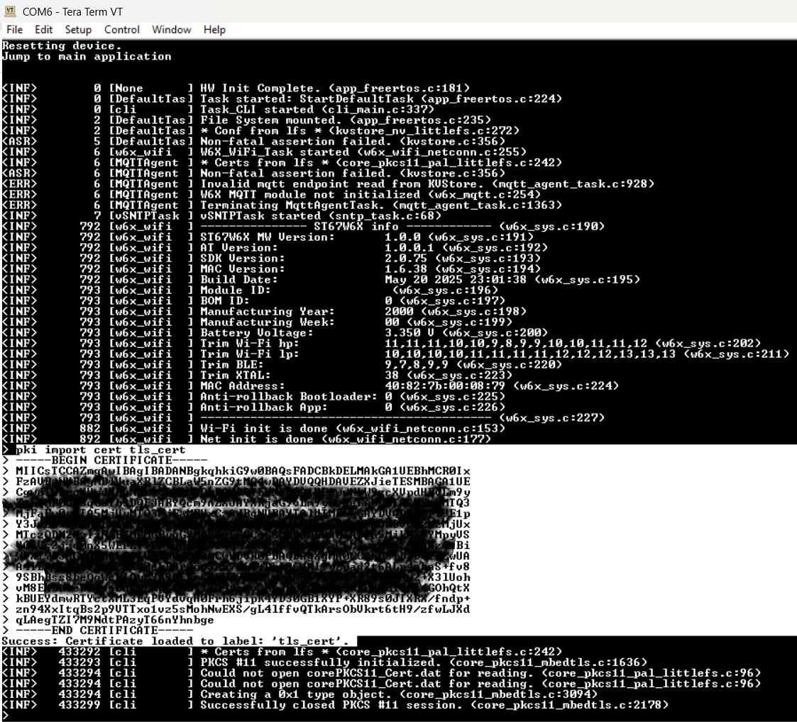

## 7. Download the server root CA certificate

Download the Mosquitto test server's root CA certificate:

```sh
wget https://test.mosquitto.org/ssl/mosquitto.org.crt
```

Or download it manually from [https://test.mosquitto.org/ssl/mosquitto.org.crt](https://test.mosquitto.org/ssl/mosquitto.org.crt).

## 8. Import the server root CA certificate

We need to import the server root CA to STM32 so it can be used with TLS authentication.

- On the serial terminal connected to your board, type the following CLI command:

```
pki import cert root_ca_cert
```

- Open the **mosquitto.org.crt** file you downloaded in a text editor (such as Notepad, VS Code, or nano).

- Copy the entire contents—be sure to include the lines: `-----BEGIN CERTIFICATE-----` … `-----END CERTIFICATE-----`.

- Then, paste the content into the serial terminal where your board is running and press Enter.

The board will verify the certificate and securely store it in internal Flash using the **MbedTLS**, **PKCS#11**, and **LFS** libraries. If everything is successful, you’ll see a confirmation message in the terminal.

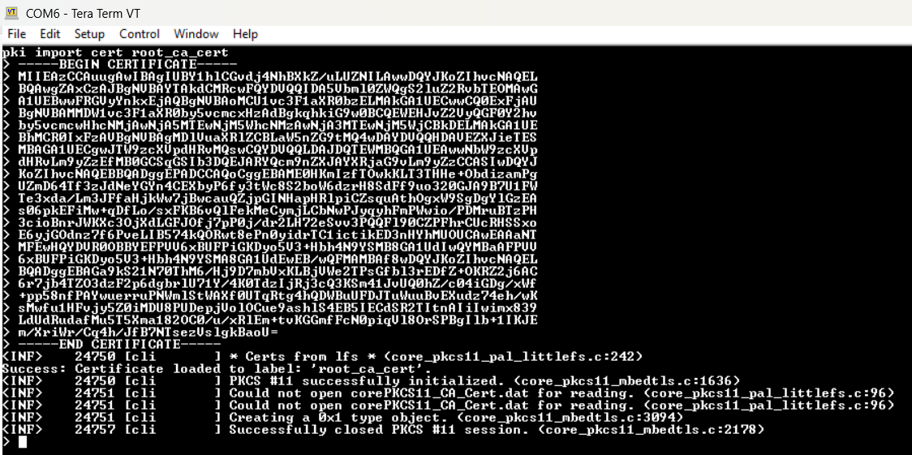

## 9. Set Runtime configuration

- Set the endpoint. Type the following command on the serial terminal:

```
conf set mqtt_endpoint test.mosquitto.org
```

- Set the MQTT port. Type the following command on the serial terminal:

```
conf set mqtt_port 8884
```

> Port 8884 is used by test.mosquitto.org for mutual TLS authentication with client certificates.

- Set the Wi-Fi SSID and password. Type the following command on the serial terminal:

```
conf set wifi_ssid < YourSSID >
conf set wifi_credential < YourPASSWORD>
```

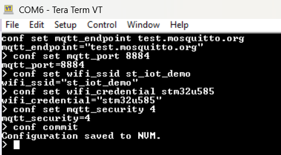

- Use *conf get* to confirm your configuration.
- You can use *conf set < key > < value >* to make any updates.
- Use *conf commit* to save configuration updates.

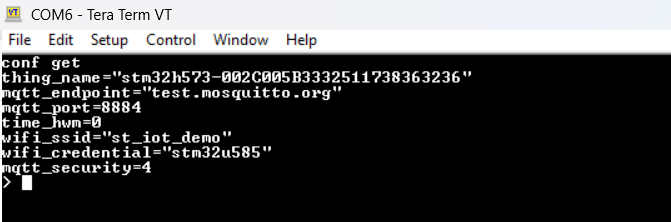

## 10. Reset the board

In the serial terminal connected to your board, type the following command:

```
reset
```

This will reboot the device. Upon startup, the firmware will use the newly imported TLS client certificate and configuration to securely connect to the MQTT broker.

Once connected, you should see confirmation messages in the terminal indicating a successful TLS handshake and MQTT session establishment.

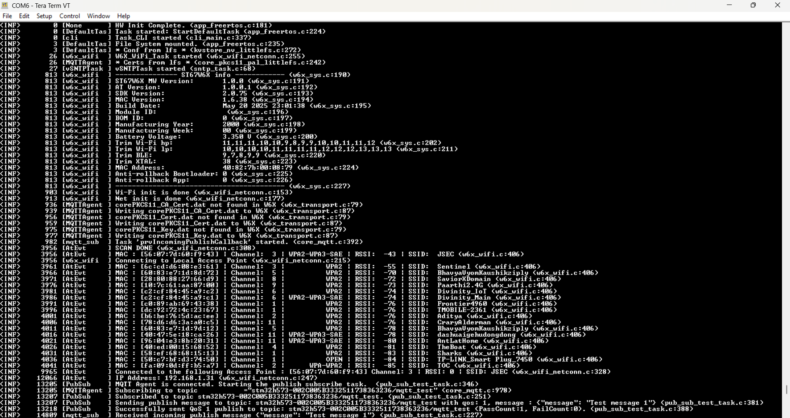

## 11. Monitor Messages

1. Subscribe to `<thing_name>/sensor/button/reported`
2. Press/release USER button
3. Observe state updates

You can use any MQTT client to monitor button state updates.

For mosquitto and EMQX you can use MQTTX Web Client
- https://mqttx.app/web-client

Configuration for mosquitto
- 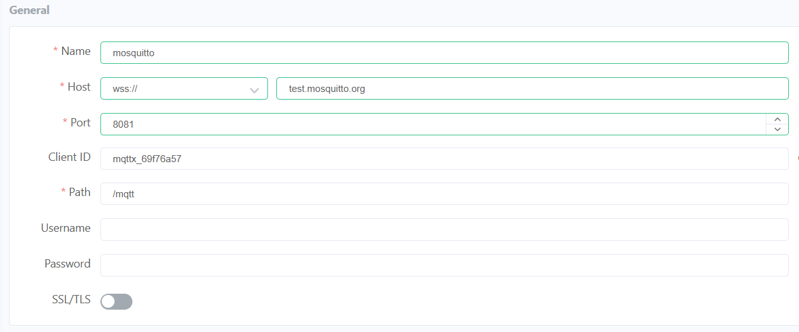

Configuration for EMQX
- 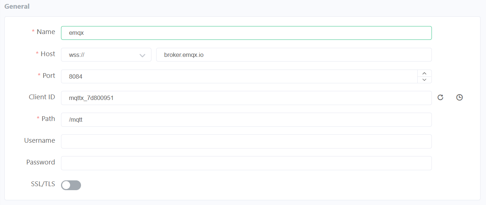

Screenshots:
- 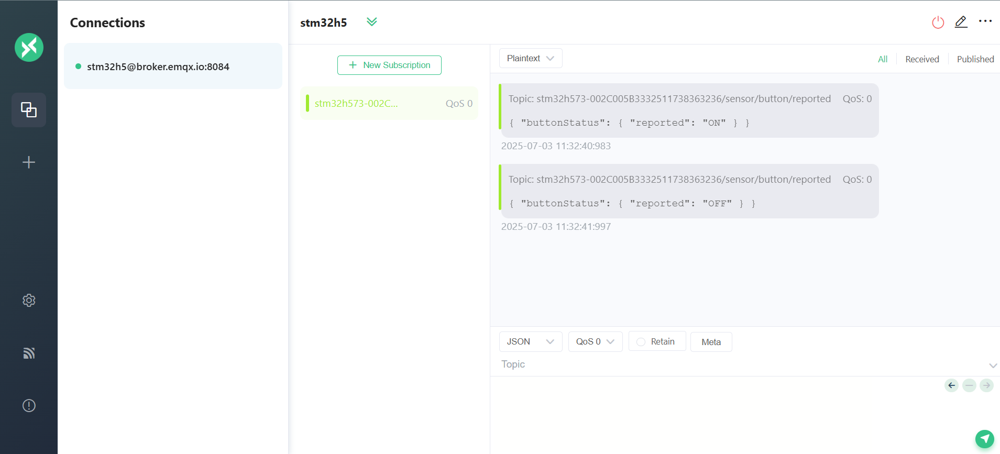
