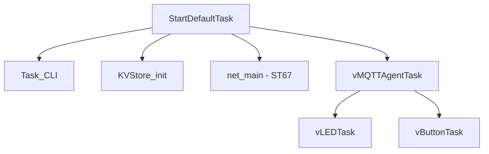

# STM32N6570-DK + ST67W611M1
### Secure MQTT-over-TLS Reference Firmware

This repository provides a complete MQTT-over-TLS reference for the [STM32N6570-DK](https://www.st.com/en/evaluation-tools/stm32n6570-dk.html) paired with the [ST67W611M1](https://www.st.com/content/st_com/en/campaigns/st67w-wifi6-bluetooth-thread-module-z13.html).

It is built for a repeatable bring-up workflow: flash, provision, validate, and then move to source-level build/debug in STM32CubeIDE.
Validated broker flows in this repository are AWS IoT Core and Mosquitto.

## ⚡ Hardware Crypto Acceleration

This firmware leverages the STM32N6570's advanced cryptographic hardware accelerators to enhance security performance:

| Accelerator | Feature | Use Case |
|---|---|---|
| **RNG** | Hardware Random Number Generator | Secure key generation, TLS nonce/IV generation |
| **SHA256** | SHA2 hardware hashing | Certificate validation, MQTT message integrity |
| **AES** | AES-128/256 encryption/decryption | TLS symmetric encryption, symmetric key operations |
| **PKA** | Public Key Accelerator | TLS handshake (ECDSA), certificate-based authentication |

These accelerators are **enabled by default** in MbedTLS via hardware abstraction interfaces (`aes_alt`, `sha256_alt`, `rng_alt`, `ecp_alt`) and are automatically used during TLS handshakes and cryptographic operations. This results in:
- ✅ **Faster TLS handshakes** (PKA acceleration for elliptic curve operations)
- ✅ **Reduced CPU load** during encryption/decryption
- ✅ **Lower power consumption** for IoT deployments
- ✅ **Improved throughput** for secure MQTT communication

Configuration details: See [Appli/Common/crypto/ReadMe.md](Appli/Common/crypto/ReadMe.md) and [Appli/Core/Inc/mbedtls_config_hw.h](Appli/Core/Inc/mbedtls_config_hw.h).

## What This Project Covers

- Hardware:
  - STM32N6570-DK (with integrated cryptographic accelerators)
  - ST67W611M1 (T02 mission profile, Wi-Fi 6)
- Security:
  - **Hardware-accelerated cryptography** (RNG, SHA256, AES, PKA)
  - MbedTLS 3.1.1 with hardware abstraction layer
  - PKCS#11-based key and certificate management
  - Secure provisioning workflows
- Application demos:
  - LED control over MQTT
  - Button event reporting over MQTT
- Provisioning targets:
  - AWS IoT Core (with auto-provisioning)
  - Mosquitto

## Required Software

- [STM32CubeProgrammer](https://www.st.com/en/development-tools/stm32cubeprog.html) (required for flashing)
- [STM32CubeIDE](https://www.st.com/en/development-tools/stm32cubeide.html) (required for build/debug from source)
- [STM32CubeMX](https://www.st.com/en/development-tools/stm32cubemx.html) (required for project regeneration)

If you use AWS IoT Core:

- [AWS account](https://aws.amazon.com/)
- [AWS CLI installation](https://docs.aws.amazon.com/cli/latest/userguide/getting-started-install.html)
- [`aws configure` quickstart](https://docs.aws.amazon.com/cli/latest/userguide/cli-configure-quickstart.html)

## Quick Start

1. Clone with submodules:
   - `git clone https://github.com/SlimJallouli/stm32n6570_dk_w6x_iot_reference.git --recurse-submodules`
2. Update ST67 to T02 mission profile using `NCP_update_mission_profile_t02`:
   - https://github.com/STMicroelectronics/x-cube-st67w61/tree/main/Projects/ST67W6X_Scripts/Binaries
3. Move to the scripts directory:
   - `cd bin`
4. Edit broker and Wi-Fi settings in [`config.json`](bin/config.json)
5. Run:
   - `.\run_all.ps1`
6. Open serial logs and validate LED/Button MQTT behavior.

For full scripted flashing/provisioning details, see [`bin/readme.md`](bin/readme.md).

## Build Configurations

The `Appli` project in STM32CubeIDE comes with two build configurations, allowing you to choose between hardware-accelerated and software-only cryptography:

| Configuration | Crypto Implementation | Performance | Use Case |
|---|---|---|---|
| **HW_Crypto** (default) | Hardware accelerators (RNG, SHA256, AES, PKA) | ⚡ Fast, low CPU/power | Production, performance-critical deployments |
| **SW_Crypto** | Pure software implementation (mbedTLS standard) | Standard | Development, testing, validation without hardware features |

**Switching configurations:**
1. In STM32CubeIDE: Right-click `Appli` → Build Configurations → Set Active
2. Or use the configuration dropdown in the toolbar
3. Rebuild the project (Project → Clean / Build)

Both configurations use identical MQTT/FreeRTOS/LwIP stacks and are binary-compatible for provisioning workflows—only the crypto backend differs.

## Runtime Architecture

## Documentation Guide

| Topic | File |
|---|---|
| Architecture and middleware | [docs/architecture.md](docs/architecture.md) |
| Software components | [docs/software_components.md](docs/software_components.md) |
| Flash and RAM memory layout | [docs/memory_layout.md](docs/memory_layout.md) |
| Hardware crypto accelerators | [Appli/Core/Src/crypto/CRYPTO_ACCELERATORS.md](Appli/Core/Src/crypto/CRYPTO_ACCELERATORS.md) |
| Build, debug, and flash | [docs/debug.md](docs/debug.md) |
| Scripted flash/provision flow | [bin/readme.md](bin/readme.md) |
| MQTT topic/data model | [docs/mqtt_data_model.md](docs/mqtt_data_model.md) |
| AWS provisioning | [docs/provisioning_aws.md](docs/provisioning_aws.md) |
| Mosquitto provisioning | [docs/provisioning_mosquitto.md](docs/provisioning_mosquitto.md) |
| Repository structure | [docs/repo_structure.md](docs/repo_structure.md) |
| Troubleshooting | [docs/troubleshooting.md](docs/troubleshooting.md) |

## Module Guides

- Button app: [Appli/Common/app/button/readme.md](Appli/Common/app/button/readme.md)
- LED app: [Appli/Common/app/led/readme.md](Appli/Common/app/led/readme.md)
- CLI: [Appli/Common/cli/ReadMe.md](Appli/Common/cli/ReadMe.md)
- Crypto: [Appli/Common/crypto/ReadMe.md](Appli/Common/crypto/ReadMe.md)
- KVStore: [Appli/Common/kvstore/ReadMe.md](Appli/Common/kvstore/ReadMe.md)

## Build and Flash Paths

- Import both projects into STM32CubeIDE:
  - `FSBL`
  - `Appli`
- Build and debug/flash details:
  - [docs/debug.md](docs/debug.md)

## Git Submodules Used

- [corePKCS11](https://github.com/FreeRTOS/corePKCS11)
- [littlefs](https://github.com/littlefs-project/littlefs)
- [tinycbor](https://github.com/intel/tinycbor)
